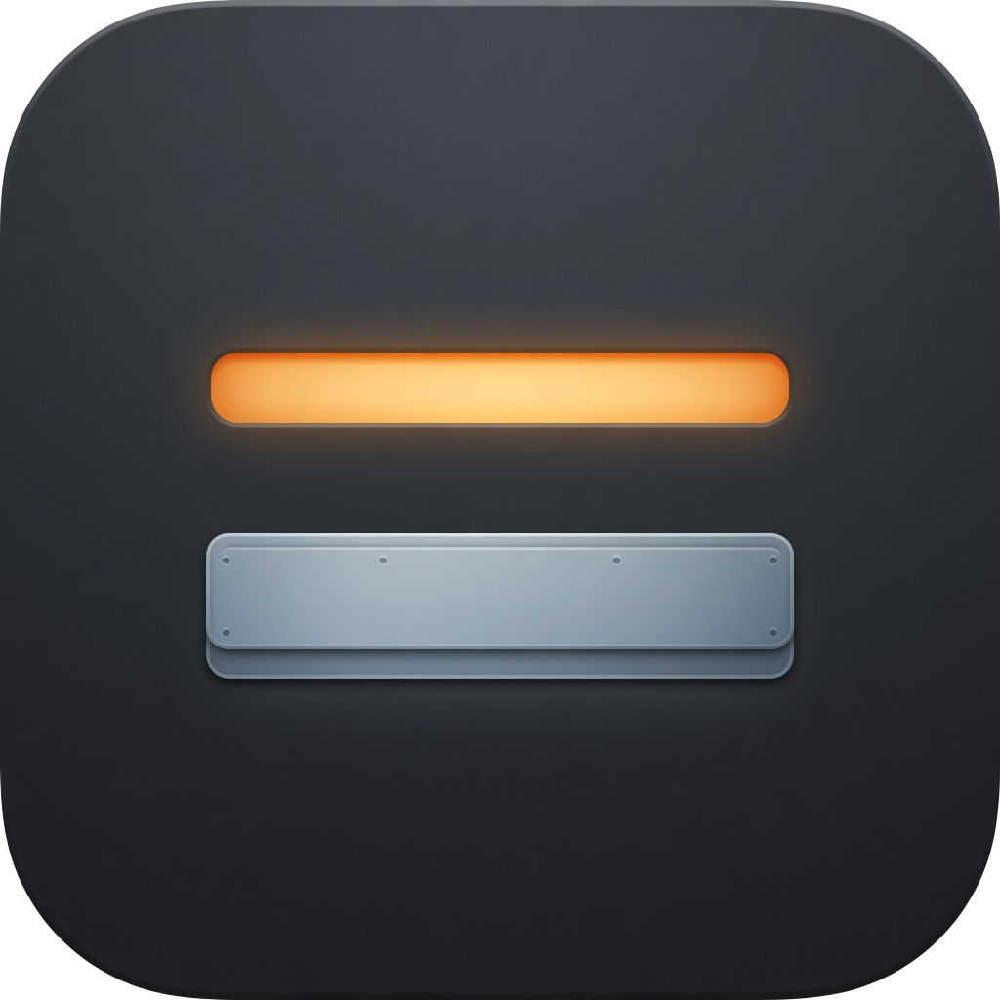
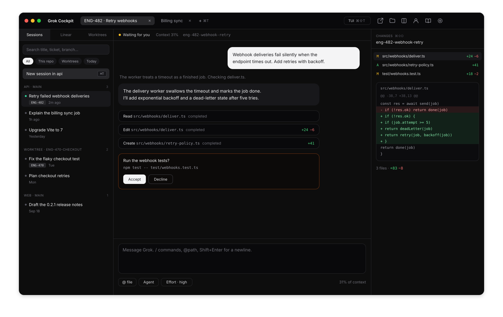

<div align="center">



<h1>Grok Cockpit</h1>

<p><b>A calm, native home for your Grok sessions.</b></p>

<p>Talk to Grok, start work from a Linear ticket, and review every change — all in one window.</p>

<br>

<a href="https://github.com/Arjun2908/grok-cockpit/releases/latest"><picture><source media="(prefers-color-scheme: dark)" srcset="docs/assets/download-dark.svg"></picture></a>

<p><sub>For Apple silicon Macs &nbsp;·&nbsp; Signed and notarized &nbsp;·&nbsp; Updates itself</sub></p>

<br>



</div>

<br>

### Conversations, not scrollback.

Grok's replies, file edits, and tool calls arrive as clean, readable cards the moment they happen. When Grok needs a decision — an answer, a plan, a permission — it stays on screen until you give one.

### The terminal is one keystroke away.

Press <kbd>⌘⇧T</kbd> to open the same session in Grok's own terminal, history and all. Press it again to come back.

### Start from the ticket.

Pick a Linear issue and Cockpit opens a session that already knows the task. Give it its own worktree and branch, or keep it in your main checkout.

### Every change, in view.

The changes pane lists each file Grok touched and the exact lines, right beside the conversation.

### Nothing gets lost.

Every past session lives in the sidebar, grouped by project and branch. Search by title, ticket, or branch, and pick up where you left off.

## Get started

1. [Download the latest release](https://github.com/Arjun2908/grok-cockpit/releases/latest) and open the disk image.
2. Drag **Grok Cockpit** into Applications.
3. Open it and press <kbd>⌘T</kbd> to start a session.

Cockpit runs the Grok CLI you already have, from `~/.grok/bin/grok`. It never ships a copy of its own.

## Keyboard

| Shortcut | Action |
| :-- | :-- |
| <kbd>⌘T</kbd> | New session |
| <kbd>⌘W</kbd> | Close tab. The app stays open |
| <kbd>⌘1</kbd> – <kbd>⌘9</kbd> | Jump to a tab |
| <kbd>⌘⇧[</kbd> <kbd>⌘⇧]</kbd> | Previous or next tab |
| <kbd>⌘⇧T</kbd> | Switch between chat and terminal |
| <kbd>⌘⇧\\</kbd> | Split with another tab |
| <kbd>⌘K</kbd> | Skills |
| <kbd>⌘L</kbd> | Find a Linear ticket |
| <kbd>⌘⇧D</kbd> | Changes |
| <kbd>⌘⇧C</kbd> | Open in Cursor |
| <kbd>⌘⇧F</kbd> | Show in Finder |
| <kbd>⌘,</kbd> | Settings |
| <kbd>⌘⇧/</kbd> | This guide |

In a conversation, <kbd>Return</kbd> sends, <kbd>⇧Return</kbd> adds a line, <kbd>/</kbd> opens commands, and <kbd>@</kbd> attaches a file.

## Good to know

- **Linear.** Add an API key in Settings, or set `LINEAR_API_KEY`. Without one, type a ticket ID and launch it anyway.
- **Worktrees.** Cockpit creates them at `/private/tmp/<slug>-wt` and prepares them with your repo's `.cursor/hooks/worktree-setup.sh`. Start them from Cockpit, not with `grok --worktree`.
- **Chat and terminal.** Switching a session between the two stops the turn in progress.
- **Tests.** Two tabs in the same worktree share Nutshell's PHPUnit database. Cockpit warns you when that happens. Run one test process at a time.
- **Updates.** Shortly after launch, Cockpit checks for a newer signed build. When one is ready, a bar at the top offers **Download**, then **Restart**. Development builds don't update.

## Build from source

<details>
<summary>Requires Node.js on an Apple silicon Mac.</summary>

```bash
git clone https://github.com/Arjun2908/grok-cockpit.git
cd grok-cockpit
npm install
npm test
npm run dev
```

`npm install` rebuilds `node-pty` for Electron. If that step fails, run `npx electron-rebuild -f -w node-pty`.

</details>

## Releases

Every release is a notarized `Grok-Cockpit-<version>-arm64.dmg`, with checksums in `SHA256SUMS`. See what changed in the [changelog](https://github.com/Arjun2908/grok-cockpit/blob/main/CHANGELOG.md), or how a build is made in [docs/releasing.md](https://github.com/Arjun2908/grok-cockpit/blob/main/docs/releasing.md).

<br>

<p align="center"><sub>Designed and built by <a href="https://github.com/Arjun2908">Arjun Gupta</a>. Also by Arjun: <a href="https://github.com/Arjun2908/worktree-manager">Worktree Manager</a>.</sub></p>
